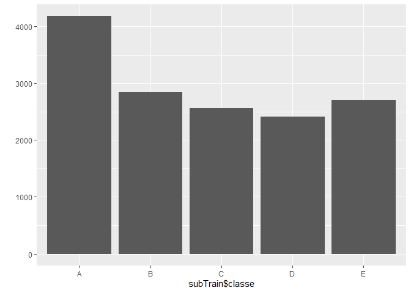
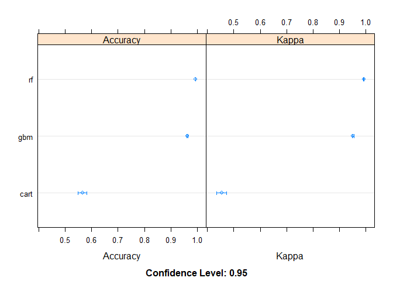
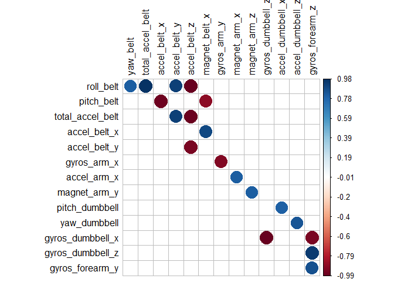
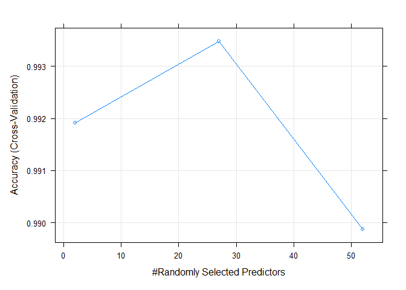

## Executive Summary
This report is for the Coursera Practical Machine Learning Course Project. 

Data from the accelerometers on the belt, forearm, arm, and dumbbell of 6 participants were used to predict the the manner in which they did the exercise. This report will describe how I built my model, how I used cross validation, what I think the expected out of sample error is. 

Three models were evaluated: a) Classification Tree, b) Random Forest, and c) Gradient Boosting Machines using a 5-fold cross validation on a training set. The evaluation showed that random forest was the most accurate model with 99% in-sample accuracy. Using a validation set, the out of sample error was 0.7%. The random forest model was used to predict the 20 test cases provided.

## Background
Using devices such as Jawbone Up, Nike FuelBand, and Fitbit it is now possible to collect a large amount of data about personal activity relatively inexpensively. These type of devices are part of the quantified self movement – a group of enthusiasts who take measurements about themselves regularly to improve their health, to find patterns in their behavior, or because they are tech geeks. One thing that people regularly do is quantify how much of a particular activity they do, but they rarely quantify how well they do it. In this project, your goal will be to use data from accelerometers on the belt, forearm, arm, and dumbbell of 6 participants. They were asked to perform barbell lifts correctly and incorrectly in 5 different ways. More information is available from the website here: http://groupware.les.inf.puc-rio.br/har (see the section on the Weight Lifting Exercise Dataset). 

## Data 
The training data for this project are available here: 

https://d396qusza40orc.cloudfront.net/predmachlearn/pml-training.csv

The test data are available here:

https://d396qusza40orc.cloudfront.net/predmachlearn/pml-testing.csv

The data for this project come from this source: http://groupware.les.inf.puc-rio.br/har. If you use the document you create for this class for any purpose please cite them as they have been very generous in allowing their data to be used for this kind of assignment.

## Report is divided into:
1) [Load Data](#load-data)
2) [Explore Data](#explore-data)
3) [Prepare Data](#prepare-data)
4) [Evaluate Algorithms](#evaluate-algorithms)
5) [Predict Test Set](#predict-test-set)

## 1) Load Data
### Load libraries

```r
library(lattice)
library(ggplot2)
library(caret)
```

### Load dataset

```r
if(!file.exists("./data")){dir.create("./data")}
url1 <- "https://d396qusza40orc.cloudfront.net/predmachlearn/pml-training.csv"
url2 <- "https://d396qusza40orc.cloudfront.net/predmachlearn/pml-testing.csv"
f1 <- file.path("./data", "pml-training.csv")
f2 <- file.path("./data", "pml-testing.csv")
download.file(url1, f1)
download.file(url2, f2)

training = read.csv(f1, sep=",", header=TRUE, na.strings = c("NA","",'#DIV/0!'))
testing = read.csv(f2, sep=",", header=TRUE, na.strings = c("NA","",'#DIV/0!'))
```

### Split training set into sub-training/test sets

```r
set.seed(8484)
inTrain <- createDataPartition(training$classe, p = 3/4)[[1]]

subTrain <- training[ inTrain,]

validation <- training[-inTrain,]
```

## 2) Explore Data
### Descriptive statistics

```r
str(subTrain, list.len=10, vec.len=2.5)
```

```
## 'data.frame':	14718 obs. of  160 variables:
##  $ X                       : int  2 4 5 6 7 9 ...
##  $ user_name               : chr  "carlitos" "carlitos" ...
##  $ raw_timestamp_part_1    : int  1323084231 1323084232 1323084232 1323084232 1323084232 1323084232 ...
##  $ raw_timestamp_part_2    : int  808298 120339 196328 304277 368296 484323 ...
##  $ cvtd_timestamp          : chr  "05/12/2011 11:23" "05/12/2011 11:23" ...
##  $ new_window              : chr  "no" "no" ...
##  $ num_window              : int  11 12 12 12 12 12 ...
##  $ roll_belt               : num  1.41 1.48 1.48 1.45 1.42 1.43 ...
##  $ pitch_belt              : num  8.07 8.05 8.07 8.06 8.09 8.16 ...
##  $ yaw_belt                : num  -94.4 -94.4 -94.4 -94.4 -94.4 -94.4 ...
##   [list output truncated]
```

The first 7 columns are metadata that can be removed from the analysis. There are also many columns with missing values which we will remove them later.

### Visualization
The "classe" variable is plotted out to visualize the spead of the types of exercise.

```r
qplot(subTrain$classe)
```

<!-- -->

Seem to be an even spread across the different labels with "A" about 30% higher than the rest.

## 3) Prepare Data
### Clean data

Remove metadata (rows 1-7)

```r
subTrain <- subTrain[,-c(1:7)]
```

Remove variables that contains mostly missing values

```r
# Check number of NAs in each column
table(colSums(is.na(subTrain)))
```

```
## 
##     0 14419 14420 14421 14423 14424 14429 14446 14473 14474 14475 14476 14477 
##    53    67     1     1     2     8     2     2     1     1     1     6     2 
## 14718 
##     6
```

100 variables contains 98% or more missing values (14409/14718*100) and will be removed from the analysis.


```r
subTrain<- subTrain[,colSums(is.na(subTrain))<14409]
```

Next, the variables with near-zero variance will be removed.


```r
nearZeroVar(subTrain)
```

```
## integer(0)
```

After removing the variables with missing values, the remaining 53 variables do not have near-zero variance.

## 4) Evaluate Algorithms
### Train Control

A 5-fold **cross validation** will be used to estimate accuracy.

```r
control <- trainControl(method="cv", number=5, verboseIter=FALSE)
metric <- "Accuracy"
```

First, we will evaluate 3 algorithms:

a) Classification Tree
b) Random Forest
c) Gradient Boosting Machines


```r
# a) Classification Tree
set.seed(86)
fitCart <- train(classe ~ .,method="rpart",data=subTrain, metric=metric, trControl=control)

# b) Random Forest
set.seed(86)
fitRF <- train(classe ~ .,method="rf",data=subTrain, metric=metric, trControl=control)

# c) Gradient Boosting Machines
set.seed(86)
fitGbm <- train(classe ~ .,method="gbm",data=subTrain, metric=metric, trControl=control, verbose=FALSE)

# summarize accuracy of models
results <- resamples(list(cart=fitCart, rf=fitRF, gbm=fitGbm))
summary(results)
```

```
## 
## Call:
## summary.resamples(object = results)
## 
## Models: cart, rf, gbm 
## Number of resamples: 5 
## 
## Accuracy 
##           Min.   1st Qu.    Median      Mean   3rd Qu.      Max. NA's
## cart 0.5499321 0.5551783 0.5638587 0.5652973 0.5744392 0.5830785    0
## rf   0.9928620 0.9932065 0.9935484 0.9934773 0.9938838 0.9938859    0
## gbm  0.9588855 0.9612508 0.9619565 0.9616792 0.9629881 0.9633152    0
## 
## Kappa 
##           Min.   1st Qu.    Median      Mean   3rd Qu.      Max. NA's
## cart 0.4352032 0.4414794 0.4529750 0.4535862 0.4662315 0.4720419    0
## rf   0.9909711 0.9914065 0.9918397 0.9917493 0.9922623 0.9922667    0
## gbm  0.9479911 0.9509655 0.9518614 0.9515200 0.9531794 0.9536027    0
```

```r
dotplot(results)
```

<!-- -->

```r
# Summary of best model
fitRF
```

```
## Random Forest 
## 
## 14718 samples
##    52 predictor
##     5 classes: 'A', 'B', 'C', 'D', 'E' 
## 
## No pre-processing
## Resampling: Cross-Validated (5 fold) 
## Summary of sample sizes: 11773, 11776, 11775, 11774, 11774 
## Resampling results across tuning parameters:
## 
##   mtry  Accuracy   Kappa    
##    2    0.9919144  0.9897715
##   27    0.9934773  0.9917493
##   52    0.9898761  0.9871935
## 
## Accuracy was used to select the optimal model using the largest value.
## The final value used for the model was mtry = 27.
```

Random forest was the most accurate model. 

Next is to get an idea of the accuracy of the model using the validation set. The RF model will be used on a validation set and summarized using a confusion matrix.


```r
predictions <- predict(fitRF, validation)
confusionMatrix(predictions, factor(validation$classe))
```

```
## Confusion Matrix and Statistics
## 
##           Reference
## Prediction    A    B    C    D    E
##          A 1393    9    0    0    0
##          B    0  938    7    0    0
##          C    1    2  846   12    0
##          D    0    0    2  791    0
##          E    1    0    0    1  901
## 
## Overall Statistics
##                                          
##                Accuracy : 0.9929         
##                  95% CI : (0.9901, 0.995)
##     No Information Rate : 0.2845         
##     P-Value [Acc > NIR] : < 2.2e-16      
##                                          
##                   Kappa : 0.991          
##                                          
##  Mcnemar's Test P-Value : NA             
## 
## Statistics by Class:
## 
##                      Class: A Class: B Class: C Class: D Class: E
## Sensitivity            0.9986   0.9884   0.9895   0.9838   1.0000
## Specificity            0.9974   0.9982   0.9963   0.9995   0.9995
## Pos Pred Value         0.9936   0.9926   0.9826   0.9975   0.9978
## Neg Pred Value         0.9994   0.9972   0.9978   0.9968   1.0000
## Prevalence             0.2845   0.1935   0.1743   0.1639   0.1837
## Detection Rate         0.2841   0.1913   0.1725   0.1613   0.1837
## Detection Prevalence   0.2859   0.1927   0.1756   0.1617   0.1841
## Balanced Accuracy      0.9980   0.9933   0.9929   0.9917   0.9998
```

The accuracy is 99.3% which is about the same as the in-sample accuracy. 
The **out of sample error is 0.7%**. 
This suggest that this model is accurate and reliable model.

## 5) Predict Test Set
The random forest model with 99.3% accuracy and 0.7% expected out of sample error will be used to predict the manner of exercise (classe) for the 20 different test cases


```r
predTest <- predict(fitRF, testing)
predTest
```

```
##  [1] B A B A A E D B A A B C B A E E A B B B
## Levels: A B C D E
```

## Appendix

Correlation matrix of variables of the sub-training set with strong correlation (>0.8)


```r
# Run correlation
corrPlot <- cor(subTrain[, -length(names(subTrain))])

# Drop duplicates and perfect correlations (cor = 1)
corrPlot[lower.tri(corrPlot,diag=TRUE)] <- NA
corrPlot[corrPlot == 1] <- NA

# Convert into a 3-column df
corrPlot <- as.data.frame(as.table(corrPlot))

# Remove the NA values table 
corrPlot <- na.omit(corrPlot)

# Select strong correlations
corrPlot <- subset(corrPlot, abs(Freq) > 0.8)
# Sort by highest correlation
corrPlot <- corrPlot[order(-abs(corrPlot$Freq)),] 

# Convert df back into matrix in order to plot with corrplot
mat_corrPlot <- reshape2::acast(corrPlot, Var1~Var2, value.var="Freq")

# Plot
corrplot::corrplot(mat_corrPlot, is.corr = FALSE, na.label=" ", tl.col="black", cl.align.text="l")
```

<!-- -->

Plot random forest

```r
plot(fitRF)
```

<!-- -->
